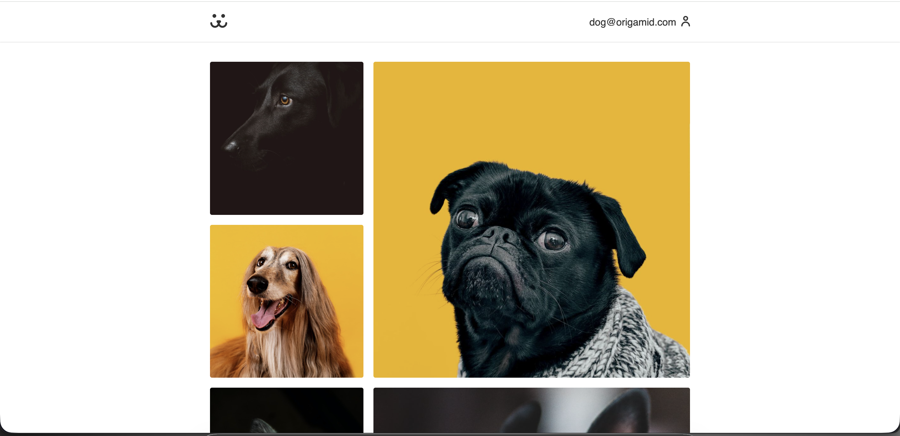
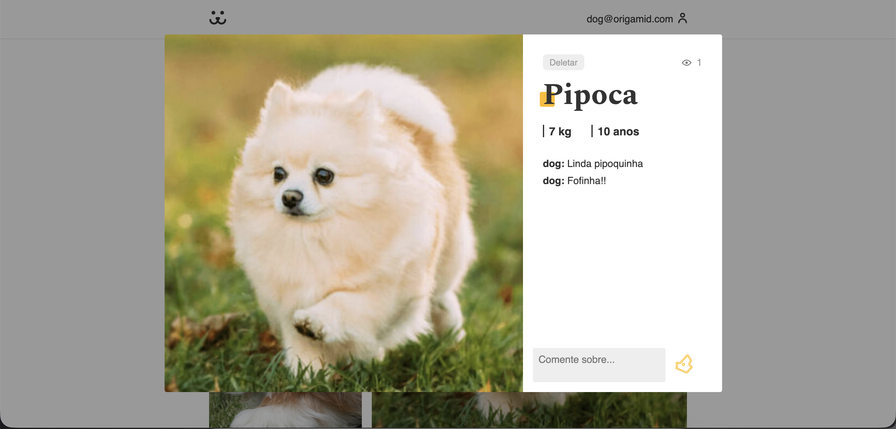
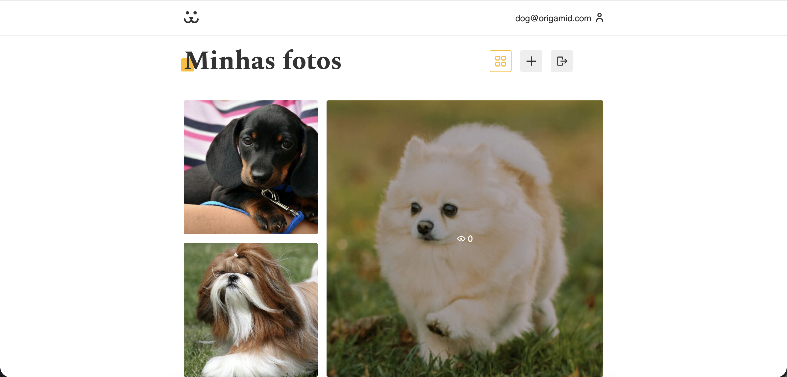
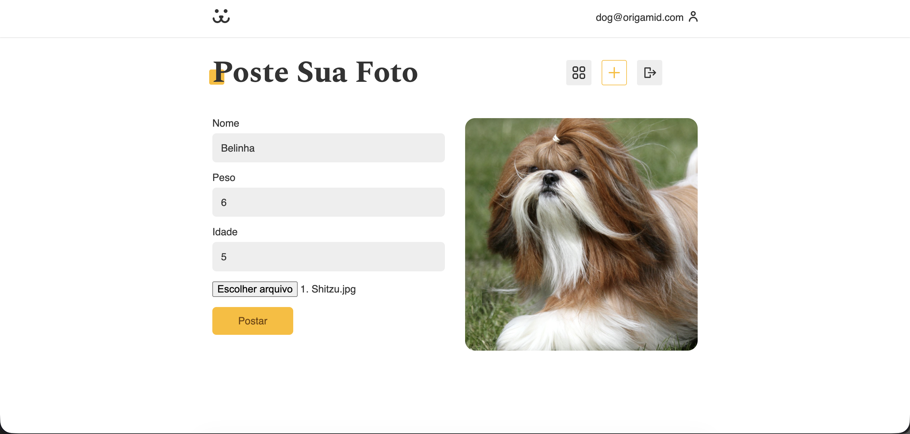

# 🐶 Insta Dog

Insta Dog é um projeto desenvolvido como desafio final do curso **React Completo** da **Origamid**.  
O objetivo do projeto foi criar uma aplicação completa inspirada em redes sociais, voltada para **postagem e interação entre fotos de cães**, utilizando **React**, **JavaScript** e **CSS nativo**.

A aplicação permite que usuários criem contas, façam login, publiquem fotos de seus cães e interajam com postagens de outros usuários por meio de comentários.

---

## 📸 Preview do Projeto

### Home

### Login

### Cadastro

### Recuperação de Senha

### Modal da Foto

### Minhas Fotos

### Postar Foto

---

## 🎯 Objetivo do Projeto

O intuito do Insta Dog foi simular uma **rede social funcional**, onde:

- Donos de cães podem criar suas próprias contas
- Publicar fotos dos seus cães
- Visualizar fotos de outros usuários
- Comentar em fotos
- Gerenciar suas próprias postagens

Além disso, o projeto teve como foco principal o **aprendizado prático de React**, consumo de API e organização de código em aplicações front-end modernas.

---

## ⚙️ Funcionalidades

- ✅ Cadastro de usuários
- ✅ Login com autenticação via token
- ✅ Persistência de sessão
- ✅ Recuperação de senha
- ✅ Upload de fotos
- ✅ Visualização de feed
- ✅ Modal com detalhes da foto
- ✅ Comentários em fotos
- ✅ Página de perfil com fotos do usuário
- ✅ Logout
- ✅ Rotas protegidas

---

## 🧠 Conceitos Trabalhados

Durante o desenvolvimento do projeto, foram aplicados diversos conceitos importantes do ecossistema React, como:

- Componentização
- Hooks (`useState`, `useEffect`, `useContext`)
- Custom Hooks
- Consumo de API REST
- Autenticação com JWT
- Rotas protegidas com React Router
- Lazy Loading
- Manipulação de formulários
- Upload de arquivos
- Estados globais com Context API
- Boas práticas de organização de pastas

---

## 🛠️ Tecnologias Utilizadas

- **React**
- **JavaScript (ES6+)**
- **CSS nativo**
- **React Router**
- **Context API**
- **API REST (fornecida pelo curso Origamid)**
- **Vite** (ou Create React App, ajuste se necessário)

---
